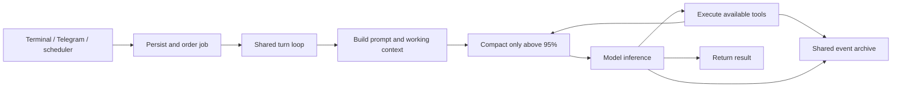

# Architecture and prompt review — 0.6

Alina should keep its present shape: one agent loop, a small tool surface, a
shared event archive, deliberately selected notes and occasional reflection.
The useful work in this review was correcting boundaries and reducing repeated
instructions. A planner, a second reflective agent, an extension VM or another
memory service would add more machinery than this POC currently needs.

Reviewed baseline: `690bee2` (0.5), including the engine, provider adapters,
transports, permissions, file handling, scheduling, memory and their tests.
The comparison below uses pinned upstream sources, not older descriptions of
what those projects did. No external source was executed or added as a dependency.

## Findings corrected

| Area | Before | Change and verification |
| --- | --- | --- |
| Per-conversation ordering | Cancelling a queued turn closed its completion barrier immediately. A subsequent turn could overtake a predecessor still waiting for consent and overwrite its transcript. | A cancelled job becomes terminal promptly but retains its queue position until its predecessor exits. Queue capacity includes these waiting cancellations. Reproduced with three turns and a pending approval. |
| Compaction and current intent | The preferred half-budget tail could discard the newest request, including an image that still fit the actual window. A large tool exchange could leave only a generated checkpoint. | Keep the active turn whole when it fits. Otherwise preserve the original request, attachments, current runtime snapshot and recent visual results alongside the checkpoint. An oversized unanswered request fails explicitly instead of being summarized before inference. |
| Generated context versus evidence | Checkpoints were recognized by a broad text-prefix heuristic. Runtime snapshots were included in the summarization input. | New checkpoints have explicit metadata. Old snapshots are excluded from summary input and synthetic content stays out of the event journal. A genuine user quotation beginning with “Continuation checkpoint” survives import. Legacy checkpoint recognition remains for upgrades. |
| Approval persistence | A persistent grant could be written before the job update failed, although approval returned an error. A shared decision channel could retain a late decision for a later operation. | Persist the job transition before adding a grant; restore pending state on failure. Each approval owns a new channel. Tests inject database failure and a stale decision. This is not a cross-file transaction against power loss. |
| Auxiliary inference | OpenAI research bypassed the inference gate, personal daily call budget and job usage totals. | Chat, checkpoints and OpenAI research use the same inference gate and accounting. Tavily/Brave are searches, not additional generative-model calls. A fixture verifies one allowed request, tracked usage and rejection at the configured budget. |
| Tool/prompt agreement | Disabled memory, search or unsupported image adapters still advertised tools; reflection inherited file-operation guidance. | Expose the supported subset and check that same set before dispatch. Reflection retains its smaller tool set. Tool schemas contain mechanics; the prompt gives brief selection guidance. |
| Provider failure boundaries | The Chat and Messages adapters did not reject output-limit truncation before consuming tool calls. Empty answers and duplicate call IDs could be accepted. | Reject truncated, empty or malformed responses before tool execution. Preserve Responses refusal text instead of silently dropping it. |
| Initiative working directory | Shell defaulted to the host workdir, while file tools defaulted to the personal workspace. Its directory check did not resolve symlinks. | Shell and file tools agree on the initiative default. Resolve and check the requested working directory. The prompt identifies the actual `sh -c` executor, rather than the user's login shell. This is not full filesystem isolation for arbitrary shell programs. |

These corrections do not add another loop or provider. The extra implementation
mainly makes cancellation, compaction and incomplete responses explicit rather
than letting them silently change the meaning of a request.

## Prompt construction

[prompts.go](../internal/alina/prompts.go) contains the shared operating contract,
memory guidance and the dream, checkpoint and research prompts. All are English.

The system instructions are assembled in this order:

1. Small common contract: identity, authorized action, proportional verification,
   internal language, evidence and permissions.
2. Brief guidance for the tools actually exposed in this turn.
3. Host/workspace metadata and configured autonomy. External strings used as
   metadata are quoted; the command shell is described accurately.
4. The bounded soul, explicitly an orientation rather than a permission policy.
   Its delimiters are escaped and its existing last-valid fallback is retained.

The working input then contains conversation history, a timestamped runtime
snapshot and the actual request with attachment references. Runtime snapshots
include an index of personal intentions, the bounded focus view and excerpts of
recent events from other channels. Full intention bodies are retrieved when
needed. Rebuilding a prompt never reinforces a note's attention.

The shared contract is **186 words**, down from **420**. A rendered default chat
example, including host metadata and seed soul, is **406 words / 2,963 bytes**,
versus **529 words / 3,731 bytes** before. The corresponding reflection system
instructions are **345 words / 2,474 bytes**, plus a 136-word reflection cue.
These are fixture text counts, not tokenizer measurements or model-quality
scores. Tool schemas, history and working memory are additional context.
See the [rendered prompt example](prompt-example.md).

Runtime snapshots remain appended to the transcript so existing messages are
stable between turns. Older snapshots therefore occupy some working context
until compaction. The newest is explicitly current; obsolete snapshots do not
become new evidence. This deliberately avoids an incremental prompt-state or
cache-management subsystem. Soul changes can invalidate part of the prefix.

Stable text helps reuse, but a shared prefix is not a guarantee of a cache hit;
boundary rules also matter. Alina preserves complete earlier messages and
records provider-reported cache usage. This review does not add public API
cache parameters to the subscription backend without validating support.
[OpenAI prompt-caching guidance](https://developers.openai.com/api/docs/guides/prompt-caching#gotchas)

The selected Astra defaults remain: 272,000 context tokens, compaction strictly
above 95%, medium normal reasoning, high dream reasoning and low checkpoint /
research reasoning. Compaction is driven by working-context pressure, not by
the clock or the dream job. Preserving a current request is more important than
meeting the preferred tail size.

## What Pi and Hermes suggest

| Project | Source-backed observation | Decision for Alina |
| --- | --- | --- |
| Pi | Its coding prompt derives guidance from the selected tool set, includes project context and loads skills by description. | Adopt capability-dependent guidance and keep procedures on demand. Do not import its coding-only identity, TUI or extension framework. |
| Pi | Its compactor chooses valid message boundaries and handles split turns explicitly. Its loop prepares context, calls the model and executes tools, with steering/follow-up hooks. | Preserve request and tool continuity in the existing loop. Do not reproduce its conversation-tree machinery. |
| Hermes | Its system prompt has stable, context and volatile portions; the assembled prompt and built-in memory snapshot are frozen and rebuilt at defined boundaries. | Keep a stable operating prefix and distinguish changing context. Do not freeze Alina's soul/memory until a new session; continuity across channels is a different design goal. |
| Hermes | Built-in notes are separate from searchable history. Optional background review reuses an agent with a restricted tool set and can conclude there is nothing to save. | Retain archive versus selected notes and the valid no-op reflection. One scheduled dream is sufficient; no additional after-every-turn review fork. |

Sources: Pi at `6160683a4a8012f0d1cd30c145df18b4ca6f5176`
([prompt](https://github.com/earendil-works/pi/blob/6160683a4a8012f0d1cd30c145df18b4ca6f5176/packages/coding-agent/src/core/system-prompt.ts),
[compaction](https://github.com/earendil-works/pi/blob/6160683a4a8012f0d1cd30c145df18b4ca6f5176/packages/agent/src/harness/compaction/compaction.ts),
[loop](https://github.com/earendil-works/pi/blob/6160683a4a8012f0d1cd30c145df18b4ca6f5176/packages/agent/src/agent-loop.ts));
Hermes at `c076d653a216939b97a93ab0c10ce709bacde667`
([system prompt](https://github.com/NousResearch/hermes-agent/blob/c076d653a216939b97a93ab0c10ce709bacde667/agent/system_prompt.py),
[built-in notes](https://github.com/NousResearch/hermes-agent/blob/c076d653a216939b97a93ab0c10ce709bacde667/tools/memory_tool_store.py),
[background review](https://github.com/NousResearch/hermes-agent/blob/c076d653a216939b97a93ab0c10ce709bacde667/agent/background_review.py)).

Alina's flow is still:

Dream enters that same loop with a reflective cue, restricted tools and a budget.
It does not move memories between time tiers or compact the conversation as a
daily maintenance ritual. Its cursor marks the latest reflection opportunity,
not proof that every event was read or understood.

## Limits and next useful work

- **Real model behavior remains unevaluated.** Fixtures establish protocol and
  persistence invariants, not whether Astra chooses good memories or produces
  useful reflections. The next high-value step is a small live set of tasks:
  cross-channel continuation, a correction to an old fact, a long tool run,
  image recall after compaction and a dream where no change is warranted.
- **Attention is a heuristic.** Its 30-day half-life affects ranking and labels;
  older notes can remain visible while the focus view has room. Reading a note
  restores attention, not confidence. It is not biological forgetting, training
  or evidence that a claim is true. Tune it from use before adding more scores.
- **Recall scales differently by mode.** FTS searches the common archive;
  optional semantic search currently scans indexed note vectors and holds
  candidates in memory before trimming. Keep this simple for small note sets;
  benchmark realistic growth before choosing a vector index. Semantic recall
  is not available automatically from ChatGPT subscription credentials.
- **New messages queue during an active same-channel job.** `/cancel` and resume
  are explicit; there is no Pi-style mid-turn steering yet. That is the most
  useful possible interaction feature to evaluate after the basic live tests.
  Foreground inference has priority between calls; an in-flight dream request
  is not preempted, so its latency also needs real-use measurement.
- **Shell freedom is a trusted-owner contract.** Native file tools have path
  checks; arbitrary shell programs are not confined to the workspace. Declared
  network policy relies partly on the agent's declarations. Strict policy has
  platform-specific enforcement. Prompt text cannot provide OS isolation.
- **Persistence has practical limits.** Files and SQLite are not one atomic
  transaction, Telegram delivery is not exactly-once, and retained transcripts /
  attachments consume storage. Existing recovery avoids automatic replay of
  uncertain tool effects; it does not prove resilience to every power-loss point.

Do not add another memory hierarchy, compulsory lesson generation, a planner or
a personality rulebook to address these limits. Prefer measurements and a few
targeted invariants over more prompt prose. Validation and device deployment
details are recorded in [verification.md](verification.md).
