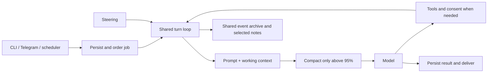

# Code and architecture review — 0.9.1

Reviewed baseline: `6be97ce` (0.9.0). Scope: CLI/setup, daemon lifecycle,
concurrency, shared agent loop, steering/permissions, provider adapters,
Telegram, web/file tools, scheduler, memory and operational logs.

The core design remains appropriate for Alina: one loop, one inference gate,
ordinary tools and a shared archive. The useful corrections are at persistence
and transport boundaries. This review adds no planner, extension runtime,
service, command, prompt layer or dependency.

## Corrected findings

| Area | Concrete failure | Correction |
| --- | --- | --- |
| Setup/login exclusion | Setup checked the socket only. A daemon still starting, another setup or a configuration patch could concurrently mutate accounts/state. | All writers use the existing exclusive daemon lock for their full operation. |
| Telegram resume | If acknowledgement delivery failed after creating a resumed job, retrying the same update started another job and repeated work. | Resume uses the stable Telegram update ID; `/new` is also stable on retries. |
| Telegram approvals | Scheduled IDs made consent button payloads 69–72 bytes. An expired callback acknowledgement could also block later updates indefinitely. | Buttons carry only the unique approval ID and scope, with owner verification. Permanent callback HTTP 400 errors are logged and consumed; transient errors retain retries. |
| Telegram backlog | Notification delivery reused the latest-50 history view, so older unsent results could disappear from delivery. Every receipt also enlarged and rewrote `telegram.json`. | Query pending persisted jobs in bounded batches, prioritize approvals, and store receipts in the existing SQLite key/value table. Migrate legacy receipts without overwriting newer ones. |
| Corrected notes | A correction citing its original source hid itself from recall/focus through implicit source invalidation. | `supersedes` replaces only the specified ID. Citations stay historical references. Existing evidence is retained; the view is updated on startup. |
| Local API polling | Each poll allocated its own HTTP transport and connection pool. Ordinary CLI errors also discarded the server's useful explanation. | Chat/wait reuse one client until exit; one-shot clients close idle connections. All local requests share bounds, cancellation and structured server errors. |
| Scheduler persistence | Pruning finished one-shots, or disabling a resolved intention, could remain in memory after a failed save. Completed one-shots blocked recurring additions, while paused tasks could grow without a total limit. | One insertion path, complete rollback, 100 enabled / 200 retained tasks; resume respects the active limit. Historical job/archive records are untouched. |
| Diagnostic repair | Successfully fixing file permissions skipped the following JSON integrity check, reporting a corrupt state file as healthy. | Repair permissions and still check the contents. |
| Provider streaming | A completed response could wait for stream EOF and then fail on timeout. Switching Responses/Messages protocols could replay incompatible raw wire objects. | Finish on the terminal event. Preserve compatible raw items; rebuild other protocols from parsed text and tool calls. |
| Web text | HTML charset sniffing corrupted UTF-8 JSON/Markdown/plain text/XML when non-ASCII text occurred after a long ASCII prefix. | Ordinary documents default to UTF-8; explicit charsets and HTML decoding remain supported. |
| Local API validation | A valid first JSON object followed by another value or garbage could trigger a mutation. | Require exactly one JSON value before dispatch. |
| Memory reads | The week compatibility view materialized the whole week before returning one page; combined SQL predicates impeded direct date/cursor lookup. | Stream every archive view through one paginator and use specific indexed date/row filters. |
| Configuration | A disabled dream accepted an invalid cron expression, although the scheduler still had to parse it at startup. | Validate the stored expression consistently. |

The Telegram payload limit is specified in the
[official Bot API](https://core.telegram.org/bots/api#inlinekeyboardbutton).
All Telegram regression requests use fixtures, not a real user's bot.

## Simplicity and flow

Dream uses the same loop with a reflective cue, smaller tool set and budget.
It does not compact context or transfer memories between calendar tiers.
Terminal/Telegram conversations order work and route replies; they do not split
the searchable memory. Recorded tool outputs and old working context remain retrievable.

System prompt construction needs no extra instructions: a short shared contract,
guidance for exposed tools, host/autonomy metadata and a bounded soul. Changing
time, intentions and memory excerpts remain in runtime snapshots. Procedures are
read on demand. English internal writing and the user's language for replies
remain unchanged. Tool schemas describe mechanics; the prompt does not repeat
the CLI manual or teach recovery around implementation bugs.

The cleanup removes unused setup/context wrappers, a retired dream-chunk table
creation, a redundant log-reader branch and fixture-only production methods.
Atomic JSON writes now reuse the text writer; local requests and task insertion
share implementations. Historical migration data is preserved. All changes stay
inside the existing package and components.

## Practical limits and next work

- SQLite/file changes and external side effects are not one transaction. A
  crash after a Telegram send can duplicate the reply, and interrupted tool
  outcomes still require verification before explicit resume. There is no
  automatic replay of uncertain commands.
- Semantic recall scans indexed vectors. Archive pagination bounds returned
  data, but a large byte offset still scans earlier records. Preserve the small
  implementation until measurements justify an index or different cursor.
- Transcripts, attachments and archive grow with use. Operational log rotation
  does not constitute an archive retention policy. Choose retention from real
  device usage instead of adding automatic deletion during this review.
- Foreground inference has priority between calls; an in-flight reflection
  request is not preempted. Model quality, reflection usefulness and real-account
  latency require live evaluation; fixture success does not establish them.
- Declared shell policy remains a trusted-owner contract. Native path checks
  and prompt text do not make arbitrary shell commands a filesystem sandbox.

The next architectural decision should follow a few real tasks: interruption
and resume, a cross-channel correction, a document/image task, and a reflection
that properly leaves memory/soul unchanged. More coordination machinery is not
needed to run those evaluations.

## Validation

Final validation and device results are recorded in [verification.md](verification.md).
The regression suite includes reproduced failures, network fixtures, failed
writes, Unicode pagination, connection reuse and a 61-job Telegram backlog with
legacy receipts. No model credentials or real Telegram messages are needed.
